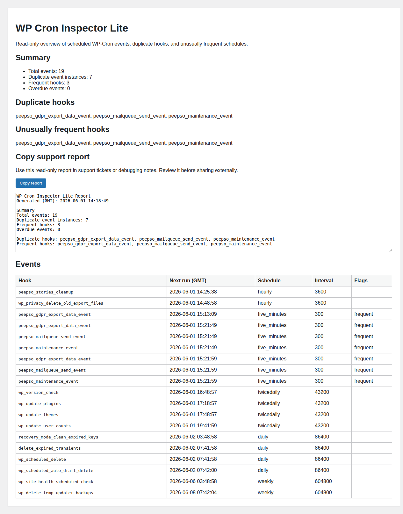

# Cron Inspector Lite

Find duplicate, stuck, and suspicious WordPress cron events before they cause support issues.

This plugin is read-only in the initial version. It lists scheduled WP-Cron events, highlights duplicate hooks, flags unusually frequent recurring events, and provides a support-friendly report.

## Screenshot



## Current v0.1 scope

- Admin page under **Tools → Cron Inspector**
- Scheduled event list
- Duplicate hook detection
- Unusually frequent event detection
- Copy support report button for support tickets/debugging notes
- Capability checks and escaped output
- No destructive cleanup actions

## Development

```bash
php tests/run.php
php tests/validate-readme.php
find . -path ./vendor -prune -o -name '*.php' -print0 | xargs -0 -n1 php -l
bash scripts/build-release.sh
```

The release package is written to `dist/cron-inspector-lite.zip`.

## Changelog

See [CHANGELOG.md](CHANGELOG.md).

## License

GPL-2.0-or-later
